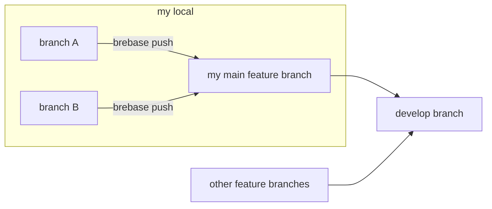

# brebase

`brebase` コマンドは、リモート リポジトリ に対する `git push|pull` コマンドのように、
ローカルにある別のブランチに対して push pull することで、ローカルで rebase git merge 戦略を行います。

コマンド:

`BREBASE_MAIN_BRANCH` 環境変数に Git の メイン フィーチャー ブランチ の名前を設定してから
`brebase` コマンド を実行してください。

    export BREBASE_MAIN_BRANCH=____
    brebase push  (or)  brebase pull

## サンプル

    ...
    $ git checkout  A   #// A ブランチで作業
    $ git commit -m "A1"
    $ export BREBASE_MAIN_BRANCH=F
    $ brebase push  #// F ブランチへマージ
    ...
    $ git commit -m "A2"
    $ brebase push
    WARNING: brebase push did not merge from "A" to "F", because "A" is behind "F".
        （訳） brebase push は A ブランチ から F ブランチ へマージしませんでした。なぜなら A は F より後ろにいるためです
    $ brebase pull  #// F ブランチからマージ
    $ brebase push  #// F ブランチへマージ

<!-- TOC depthFrom:1 -->

- [brebase](#brebase)

<!-- /TOC -->

## Push コマンド

### (準備) 一般的な git commit コマンド

`git commit` する前の コミット グラフ:

    F&A

`git commit` コマンド:

    git checkout A
    git add .
    git commit -m "A1"

`git commit` した後の コミット グラフ（右が新しい）:

    F - A

### もし現在のブランチ A が メイン フィーチャー ブランチ F より先行しているとき

`brebase push` コマンド を実行すると、メイン フィーチャー ブランチ F を
現在のブランチ A のコミットの位置に移動します。

`brebase push` する前の コミット グラフ:

    F - A

`brebase push` コマンド:

    $ export BREBASE_MAIN_BRANCH=F
    $ brebase push

`brebase push` した後の コミット グラフ（右が新しい）:

    o - F&A

### もし現在のブランチ B が メイン フィーチャー ブランチ F より後ろにいるとき

`brebase push` コマンド を実行すると、警告だけされます。終了コードは 0（正常）です。

`git commit` する前の コミット グラフ:

    B - F&A

`git commit` コマンド:

    $ git add .
    $ git commit -m "B1"

`git commit` した後の `brebase push` する前の コミット グラフ:

        B
      /
    o - F&A

`brebase push` コマンド:

    $ export BREBASE_MAIN_BRANCH=F
    $ brebase push
    WARNING: brebase push did not merge from "A" to "F", because "A" is behind "F".

コミット グラフ は変化しません。

`brebase pull` コマンド を実行する必要があります。

## Pull コマンド

`git rebase __BranchName__` を実行します。

### コンフリクトしないとき

`brebase pull` コマンド を実行すると、現在のブランチ B を メイン フィーチャー ブランチ F
の最新コミットから枝分かれするようにマージします。
このマージによって現在のブランチ B の内容が変わります。
内部で `git rebase __MainFeatureBranchName__` を実行しています。

`brebase pull` する前の コミット グラフ:

        B
      /
    o - F&A

`brebase pull` コマンド:

    $ export BREBASE_MAIN_BRANCH=F
    $ brebase pull

`brebase pull` した後 コミット グラフ:

              B
            /
    o - F&A

通常、`brebase pull` したら `brebase push` も実行します。

`brebase push` コマンド:

    $ export BREBASE_MAIN_BRANCH=F
    $ brebase push

`brebase push` した後 コミット グラフ:

    o - A - F&B

### コンフリクトするとき

`brebase pull` コマンド を実行すると、
可能な限りマージを行い、コンフリクトが発生したと表示されます。

`brebase pull` する前の コミット グラフ:

        B
      /
    o - F&A

`brebase pull` コマンド:

    $ export BREBASE_MAIN_BRANCH=F
    $ brebase pull

    git rebase "feature-1"
    Auto-merging 0.txt
    CONFLICT (content): Merge conflict in 0.txt
    error: could not apply d05667c... B1
    hint: Resolve all conflicts manually, mark them as resolved with
    hint: "git add/rm <conflicted_files>", then run "git rebase --continue".
    hint: You can instead skip this commit: run "git rebase --skip".
    hint: To abort and get back to the state before "git rebase", run "git rebase --abort".
    Could not apply d05667c... B1

内部で `git rebase` コマンド を実行したときにコンフリクトが発生したと表示されます。

終了コードは 1 です。

コンフリクトが発生したファイルについてコンフリクトを解消する編集をし、
`git rebase --continue` を実行して完了させます 

    vi 0.txt
    git add  "."
    git rebase --continue

`git rebase --continue` した後の コミット グラフ:

              B
            /
    o - F&A

`brebase push` コマンド:

    $ export BREBASE_MAIN_BRANCH=F
    $ brebase push

`brebase push` した後 コミット グラフ:

    o - A - F&B

## Status コマンド

`brebase status` コマンドを実行すると、
`brebase push` コマンド または `brebase pull` コマンド の実行が必要かどうかを表示します。
すべて標準出力に出力されます。
終了コードは常に 0（正常）です。

    $ export BREBASE_MAIN_BRANCH=____
    $ brebase status
    (git status の出力)
    WARNING: Your branch is behind '____'. Hint: run "brebase pull" and "brebase push" command.
    Your branch is ahead of '____'. Hint: run "brebase push" command.

現在のブランチが メイン フィーチャー ブランチ と同じ位置なら何も表示されません。

    $ export BREBASE_MAIN_BRANCH=____
    $ brebase status
    $

現在のブランチ B が メイン フィーチャー ブランチ に先行されているとき:

    B - F&A

または、枝分かれしているとき:

        B
      /
    o - F&A

上記の状態で `brebase status` コマンドを実行すると先行されている( `behind` )と警告されます。

    WARNING: Your branch is behind '____'. Hint: run "brebase pull" and "brebase push" command.

シェルスクリプトで分岐するときは、以下のフレーズの有無で判定してください。
すべて標準出力に出力されます。
終了コードは常に 0（正常）です。

    Your branch is behind
    Your branch is ahead
