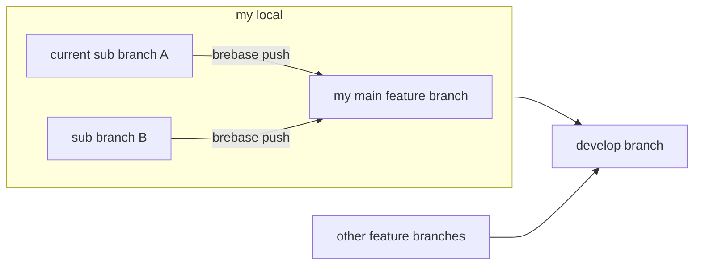

[(Japanse)](./README-jp.md)

# brebase

`brebase` command do rebase git merge strategy
by `push` or `pull` sub command to local another branch
like `git push|pull` command to|from remote repository.

Command:

Set the `BREBASE_MAIN_BRANCH` environment variable
to the name of the main feature branch
and run `brebase` command.

    export BREBASE_MAIN_BRANCH=____
    brebase push  (or)  brebase pull

## Exammple

    ...
    $ git checkout  A   #// Change current branch to A branch
    $ git commit -m "A1"
    $ export BREBASE_MAIN_BRANCH=F
    $ brebase push  #// Merge from current branch A to F branch
    ...
    $ git commit -m "A2"
    $ brebase push
    WARNING: brebase push did not merge from "A" to "F", because "A" is behind "F".
    $ brebase pull  #// Merge from F branch to current branch A
    $ brebase push  #// Merge from current branch A to F branch

<!-- TOC depthFrom:1 -->

- [brebase](#brebase)

<!-- /TOC -->

## Push command

### (Set up) General git commit command

Commit graph before `git commit`:

    F&A

`git commit` command:

    git checkout A
    git add .
    git commit -m "A1"

Commit graph after `git commit` (new on the right):

    F - A

### When your branch A is AHEAD of main feature branch F

If you run `brebase push` command, feature branch F moves to the current commit position on branch A.

Commit graph before `brebase push`:

    F - A

`brebase push` command:

    $ export BREBASE_MAIN_BRANCH=F
    $ brebase push

Commit graph after `brebase push` (new on the right):

    o - F&A

### When your branch B is BEHIND main feature branch F

If you run `brebase push` command, just you will be warned. The exit code is 0 (successful).

Commit graph before `git commit`:

    B - F&A

`git commit` command:

    $ git add .
    $ git commit -m "B1"

Commit graph after `git commit` before `brebase push`:

        B
      /
    o - F&A

`brebase push` command:

    $ export BREBASE_MAIN_BRANCH=F
    $ brebase push
    WARNING: brebase push did not merge from "A" to "F", because "A" is behind "F".

Commit graph is not changed.

        B
      /
    o - F&A

You must run `brebase pull` commad.

### When not clean status

`brebase push` command shows an error message that Git working folder is not clean status.
The exit code is 1.

Please, run `git commit` command in correct branch or run `git checkout "."` command.

## Pull command

Run `git rebase __BranchName__` を実行します。

### When not in conflict

If you run the `brebase pull` command, `git rebase __BranchName__` is executed.
It changes current branch B merged from the latest commit of main feature branch F.
This merge changes the contents of current branch B.
`brebase pull` command calls `git rebase __MainFeatureBranchName__` internally.

Commit graph before `brebase pull`:

        B
      /
    o - F&A

`brebase pull` command:

    $ export BREBASE_MAIN_BRANCH=F
    $ brebase pull

Commit graph after `brebase pull`:

              B
            /
    o - F&A

When you run the `brebase pull` command, you should also run `brebase push` command.

`brebase push` command:

    $ export BREBASE_MAIN_BRANCH=F
    $ brebase push

Commit graph after `brebase push`:

    o - A - F&B

### When in conflict

If you run the `brebase pull` command, `git rebase __BranchName__` is executed.
`brebase pull` command merges as much as possible and shows there are conflicts.

Commit graph before `brebase pull`:

        B
      /
    o - F&A

`brebase pull` command:

    $ export BREBASE_MAIN_BRANCH=F
    $ brebase pull

    git rebase "feature-1"
    Auto-merging 0.txt
    CONFLICT (content): Merge conflict in 0.txt
    error: could not apply d05667c... B1
    hint: Resolve all conflicts manually, mark them as resolved with
    hint: "git add/rm <conflicted_files>", then run "git rebase --continue".
    hint: You can instead skip this commit: run "git rebase --skip".
    hint: To abort and get back to the state before "git rebase", run "git rebase --abort".
    Could not apply d05667c... B1

It displays there was a conflict when running the `git rebase` command inside.

The exit code is 1.

Please edit the conflicted files to resolve the conflict
and complete by running `git rebase --continue`.

    vi 0.txt
    git add  "."
    git rebase --continue

Commit graph after `git rebase --continue`:

              B
            /
    o - F&A

If you want to cancel the `brebase pull` command (`git rebase __BranchName__` command),
Use the `git reflog` and `git reset --hard "HEAD@{____}"` commands.

`brebase push` command:

    $ export BREBASE_MAIN_BRANCH=F
    $ brebase push

Commit graph after `brebase push`:

    o - A - F&B

### When not clean status

`brebase pull` command shows an error message that Git working folder is not clean status.
The exit code is 1.

Please, run `git commit` command in correct branch or run `git checkout "."` command.

## Status command

If you run `brebase status` command,
it displays whether `brebase push` or `brebase pull` command needs to be run.
Every messages are printed to standard output.
The exit code is always 0 (successful).

    $ export BREBASE_MAIN_BRANCH=____
    $ brebase status
    (git status output)
    WARNING: Your branch is behind '____'. Hint: run "brebase pull" and "brebase push" command.
    Your branch is ahead of '____'. Hint: run "brebase push" command.

### If current branch is at same position as main feature branch

Nothing will be displayed.

    $ export BREBASE_MAIN_BRANCH=____
    $ brebase status
    $

### If current branch B is behind from main feature branch F

If current branch B is behind

    B - F&A

or current branch B is branched from main feature branch F:

        B
      /
    o - F&A

if you run the `brebase status` command in the above state,
you will be warned that current branch is behind.

    WARNING: Your branch is behind '____'. Hint: run "brebase pull" and "brebase push" command.

### When not clean status

`brebase status` command shows an error message that Git working folder is not clean status.
The exit code is 0.

### When shell script branches

Check the following phrase.
Every messages are printed to standard output.
The exit code is always 0 (successful).

    Your branch is behind

or

    Your branch is ahead
